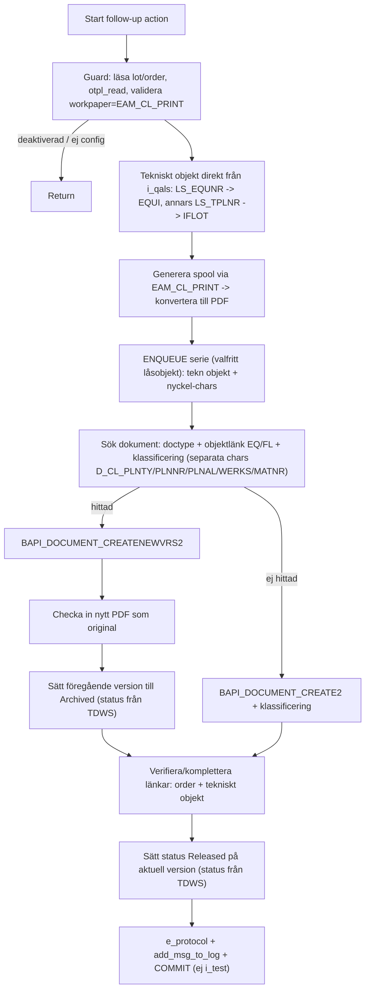

## Bakgrund och återanvändning

Båda standard-FM:erna ([eam_cl_create_dms_lot](eam_cl_create_dms_lot), [eam_cl_create_dms_order](eam_cl_create_dms_order)) gör i grunden: (1) läser config via `cl_eam_cl_cu=>otpl_read` -> `ls_otpl` (innehåller `DOCTYPE`, `STORAGECATEGORY`, `WORKPAPER`), (2) genererar spool via `SUBMIT EAM_CL_PRINT`, (3) `PERFORM create_dms_from_spool ... ls_drad` som skapar dokumentet och objektlänken. Idag länkas dokumentet bara till lot (`QALS`) eller order (`PMAUFK`):

```109:110:eam_cl_create_dms_lot
  ls_drad-dokob = 'QALS'.
  ls_drad-objky = i_qals-prueflos.
```

Vi bygger en ny FM `Z_EAM_CL_CREATE_DMS_LOT_VRS` med **samma interface** som lot-FM:en (drop-in i QM follow-up action), men ersätter steg 3 med egen logik (BAPI:er) och länkar mot tekniskt objekt + order.

**Viktigt – objektlista:** En order kan innehålla en **objektlista** med många tekniska objekt, och systemet skapar **en lot (checklista) per objekt** (inspektionslott origin 89). Det kan alltså finnas många lots per order. Det tekniska objektet måste därför hämtas för **just den aktuella loten**, inte från orderhuvudet. Det görs enklast direkt från QALS: fälten `QALS-LS_EQUNR` (utrustning) och `QALS-LS_TPLNR` (funktionsplats) bär objektet per lot, och `i_qals` finns redan i FM:ens interface.

## Flöde



## Implementation

- **Interface**: spegla `EAM_CL_CREATE_DMS_LOT` exakt (`I_QALS`, `I_QAVE`, `I_QAPO`, `I_NO_LOG_SAVE`, `I_TEST`, `I_DIALOG`, `E_SUBRC`, `E_PROTOCOL`).
- **Guard clauses**: återanvänd block från lot-FM (rad 33-68): läs `i_maintorderinspectionlot` (skip om `mainchecklistisdeactivated`), läs `aufk`, `otpl_read`, validera `t390`/`EAM_CL_PRINT` och hämta formulärtitel.
- **Tekniskt objekt (per lot!)**: läs objektet **direkt från `i_qals`** (lot-FM:en får in hela QALS-posten), vilket per definition är per lot. QALS bär objektet i `LS_EQUNR` (utrustning, dataelement `EQUNR`) och `LS_TPLNR` (funktionsplats, dataelement `TPLNR`). Regel: `i_qals-ls_equnr` ifylld → objektlänk `EQUI`, annars `i_qals-ls_tplnr` → `IFLOT`. Ingen extra SELECT mot objektlistan behövs.
- **Spool -> PDF**: återanvänd EXPORT/`SUBMIT`/IMPORT-blocket; konvertera spool med `CONVERT_OTFSPOOLJOB_2_PDF` (fallback `CONVERT_ABAPSPOOLJOB_2_PDF`) -> `SCMS_XSTRING_TO_BINARY` -> `DRAO`.
- **Sök befintligt dokument**: `SELECT FROM drad WHERE dokar = <doctype> AND dokob = <EQUI/IFLOT> AND objky = <tekn objekt>`; för träffarna läs klassificering (klasstyp `017`, klass `D_CL`, objekttabell `DRAW`) via `BAPI_OBJCL_GETDETAIL` och matcha **alla nyckel-egenskaper** (en char per fält, ingen konkatenering): `D_CL_PLNTY`/`D_CL_PLNNR`/`D_CL_PLNAL`/`D_CL_WERKS`/`D_CL_MATNR` mot `QALS-PLNTY/PLNNR/PLNAL/WERK/MATNR`. Dokumentet matchar bara om samtliga stämmer. Välj högsta `DOKVR` bland matchningar.
- **Gren – ej hittad (första version)**: `BAPI_DOCUMENT_CREATE2` med `doctype`/`storagecategory`, beskrivning, objektlänkar (`PMAUFK` order + `EQUI`/`IFLOT` tekn objekt), PDF-fil och status Released; sätt klassificering via `BAPI_OBJCL_CHANGE`/`CREATE`.
- **Gren – hittad (ny version)**: `BAPI_DOCUMENT_CREATENEWVRS` (kopierar objektlänkar + klassificering enligt doc-type-config "When New Version 1"); checka in nytt PDF som original (`CVAPI_DOC_CHECKIN`/`BAPI_DOCUMENT_CHECKIN`); sätt **föregående version** till Archived (`BAPI_DOCUMENT_SETSTATUS`/`CHANGE2`).
- **Säkerhetskontroll länkar**: verifiera att aktuell version har länk till tekniskt objekt (EQ/FL) och till aktuell order; lägg till saknad länk (skyddsnät trots copy-on-new-version).
- **Status**: aktuell version -> Released, gammal -> Archived. Statusvärdena **läses från DMS-customizing `TDWS`** per doctype (`determine_statuses`): released = `FRKNZ = 'X'`, archived = status typ `DOSAR = 'A'`. Konstanterna `gc_status_released`/`gc_status_archived` används bara som fallback.
- **Samtidighet (valfritt låsobjekt)**: `lock_series` gör `ENQUEUE_<lockobjekt>` (enkelt nyckelfält `SCOPE`, CHAR50, läge E) på serien (doctype + objekt + nyckel-chars) med `_wait = 'X'`. Släpps vid `COMMIT WORK` så parallell lot ser committat dokument och skapar ny version. Saknas låsobjektet degraderar FM:en med varning och kör vidare. `gc_lock_object = space` stänger av.
- **Idempotens (valfritt)**: om `gc_char_lot` är satt lagras `PRUEFLOS` på versionen; körs samma lot om igen hoppas ny version över. `space` = avstängt.
- **Logg/commit**: bygg `E_PROTOCOL` (meddelanden), anropa `cl_eam_cl_msg_tool=>add_msg_to_log`, `COMMIT WORK` om inte `I_TEST`. Använd `i_test` som testrun i BAPI:erna (ingen commit).

## Konstanter (bekräftade mot systemets customizing)

- `gc_classtype = '017'` (Document Management), klass `gc_class = 'D_CL'`.
- **Nyckel-egenskaper – en char per fält** (klass `D_CL`, ren läs/skriv utan parsning):
  - `gc_char_plnty = 'D_CL_PLNTY'` (CHAR1) ← `QALS-PLNTY` (provplanstyp)
  - `gc_char_plnnr = 'D_CL_PLNNR'` (CHAR8) ← `QALS-PLNNR` (provplansgrupp)
  - `gc_char_plnal = 'D_CL_PLNAL'` (CHAR2) ← `QALS-PLNAL` (gruppräknare)
  - `gc_char_werk = 'D_CL_WERKS'` (CHAR4) ← `QALS-WERK` (verk)
  - `gc_char_matnr = 'D_CL_MATNR'` (CHAR18) ← `QALS-MATNR` (material)
- `gc_char_lot` = valfri egenskap för idempotens (lagrar `PRUEFLOS`); `space` = av.
- `gc_status_released = 'FR'`, `gc_status_archived = 'AR'` är **fallback** – statusarna läses i runtime ur `TDWS` (released `FRKNZ='X'`, archived `DOSAR='A'`).
- `gc_lock_object` = valfritt kundlåsobjekt för samtidighet (`space` = av).
- `gc_storage_cat` = lagringskategori för originalet (`space` = DMS-default).

## Designval (förvalda – säg till om du vill ändra)

- **Objekt per lot**: objektet tas från `i_qals` (`LS_EQUNR`/`LS_TPLNR`). Om både är ifyllda (utrustning installerad på funktionsplats) väljs `EQUI` (utrustningen är checklistans objekt), annars `IFLOT`.
- **Inget tekniskt objekt på ordern**: fall tillbaka till order-länkat dokument (utan versionsmatchning mot tekn objekt) och logga varning. (Alternativ: hoppa helt.)
- **Orderlänkar ackumuleras**: vi säkerställer enbart aktuell order + tekniskt objekt på nya versionen; ev. medkopierade äldre orderlänkar lämnas kvar som historik.

## Förbättringar / sånt som kan ha missats

- **Idempotens**: om samma lots UD körs om ska ingen dubblettversion skapas. Förslag: lagra även `PRUEFLOS` (lotnummer) som egenskap/attribut på versionen och hoppa över om aktuell lot redan finns.
- **Samtidighet/lås**: parallella UD:n på samma tekniska objekt + provplan kan skapa dubbletter eller race vid första skapandet. Förslag: `ENQUEUE` (semafor på tekn objekt + provplan) runt sök-/skapa-blocket.
- **Statusnätverk**: övergången Released -> Archived måste vara tillåten i DMS-statusnätverket för doktypen; verifiera config. (Statusarna läses nu dynamiskt från `TDWS`: released = `FRKNZ = 'X'`, archived = status typ `DOSAR = 'A'`; konstanterna är fallback.)
- **Content versions (backlog, `content-versions-update`)**: idag hoppar idempotenskontrollen över loten om den redan producerat versionen. Önskat beteende: i stället **uppdatera** den existerande versionen med ny PDF, så att justeringar fångas. Förutsätter content versions på doktypen (varje PDF-ändring = egen content-instans). Kräver check-out av gammalt original + ersättning med ny PDF, samt jämförelse av filstorlek (ev. hash) för att undvika onödiga content-instanser. **Avvaktar tills grundflödet är verifierat.**
- **Flera matchande dokument**: tie-breaker = högsta version/senaste; överväg att logga om fler än ett "serie"-dokument hittas (datafel).
- **Titel/beskrivning**: enhetlig namngivning per version (t.ex. tekn objekt + checklisttyp) så användaren lätt hittar senaste.
- **Behörighet**: `C_DRAW_*`-kontroller hanteras av BAPI:erna; testa med körande användares behörighet.